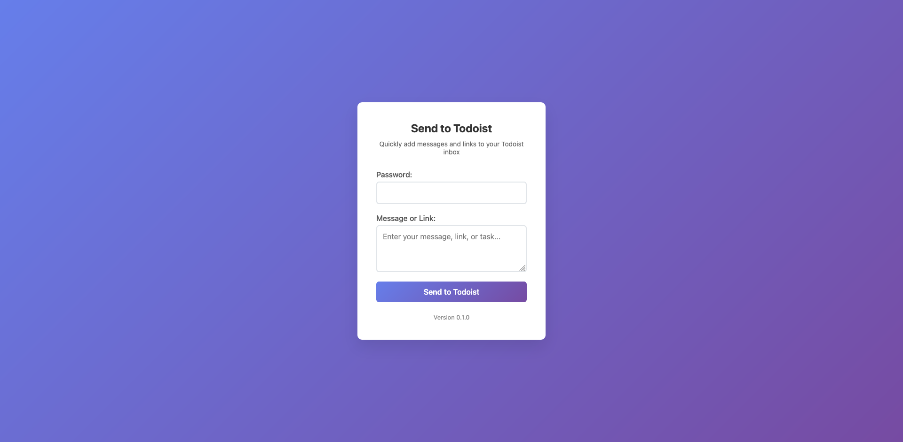

# Todoist Message Send

A simple, password-protected web form for quickly sending messages, links, or tasks to your Todoist inbox. Deployable as a Docker container, this app is ideal for personal use or sharing with trusted users.

## Features

- **Password-protected**: Only users with the correct password can submit tasks.
- **Simple UI**: Clean, responsive form for entering messages or links.
- **Direct to Todoist**: Sends submissions straight to your Todoist inbox via the Todoist API.
- **Docker-ready**: Easy to deploy anywhere using Docker or Docker Compose.
- **Healthcheck endpoint**: For container orchestration and uptime monitoring.

## Demo



## Getting Started

### Prerequisites

- [Node.js](https://nodejs.org/) (if running locally)
- [Docker](https://www.docker.com/) (recommended for deployment)
- A [Todoist API token](https://todoist.com/prefs/integrations)

### Quick Start (Docker)

1. **Clone the repository:**

   ```bash
   git clone https://github.com/tdavis6/todoist-message-send.git
   cd todoist-message-send
   ```

2. **Configure environment variables:**

   You can set these in your `.env` file or directly in `docker-compose.yml`:

   - `TODOIST_TOKEN`: Your Todoist API token
   - `APP_PASSWORD`: Password required to submit the form

3. **Run with Docker Compose:**

   ```bash
   docker-compose up -d
   ```

   The app will be available at [http://localhost:3000](http://localhost:3000).

### Manual Start (Node.js)

1. **Install dependencies:**

   ```bash
   npm install
   ```

2. **Set environment variables:**

   Create a `.env` file in the root directory:

   ```
   TODOIST_TOKEN=your_todoist_api_token
   APP_PASSWORD=your_password
   ```

3. **Start the server:**

   ```bash
   npm start
   ```

   Visit [http://localhost:3000](http://localhost:3000).

## Usage

1. Open the web form in your browser.
2. Enter the password (set by `APP_PASSWORD`).
3. Type your message, link, or task.
4. Click **Send to Todoist**.
5. The item will appear in your Todoist inbox.

## Configuration

| Variable         | Description                        | Required | Default |
|------------------|------------------------------------|----------|---------|
| `TODOIST_TOKEN`  | Todoist API token                  | Yes      |         |
| `APP_PASSWORD`   | Password to access the form        | Yes      |         |
| `NODE_ENV`       | Node environment (`production`)    | No       |         |

## Endpoints

- `/` — Main web form
- `/api/todoist` — API endpoint for submitting tasks (POST)
- `/health` — Healthcheck endpoint (returns 200 OK if running)
- `/package.json` — Used by frontend to display version

## Security

- All submissions require the correct password.
- Do **not** expose this app to the public internet without a strong password.
- Use HTTPS in production.

## Development

- Run `npm run dev` for hot-reloading with [nodemon](https://nodemon.io/).
- Frontend is a static HTML file in `public/index.html`.
- Backend is in `server.js` (not shown in this snippet).

## Docker

- The Docker image is published to GitHub Container Registry:
  `ghcr.io/tdavis6/todoist-message-send:latest`
- See [`docker-compose.yml`](docker-compose.yml) for deployment example.

## License

MIT License — see [LICENSE](LICENSE).

## Author

Tyler Davis
